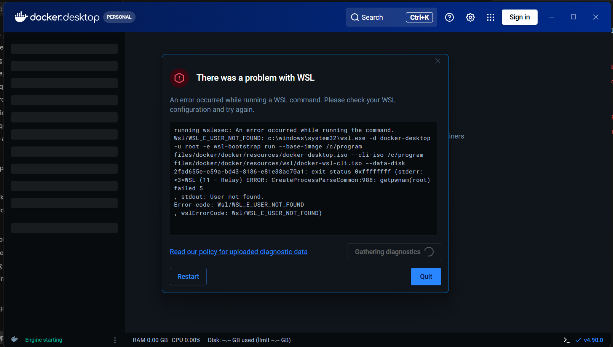

# Failure analysis (Part 26)

I broke things on purpose four ways to see what each failure actually looks like and how to spot the cause. There's also one I didn't plan, at the end.

## 1. Failed pytest

**Symptom:** PR #1 showed "Checks failing" and the merge button was blocked. The `test` job was red and `docker-build` was skipped.

**Root cause:** I changed the health test to expect `"wrong"` instead of `"healthy"`. The app was fine, the test was wrong.

**Evidence:** [run 34508751263](https://github.com/0mer16/mlops_ass/actions/runs/34508751263). The job log had:

```
tests/test_app.py::test_health FAILED                                    [ 10%]
        assert response.status_code == 200
>       assert data["status"] == "wrong"
E       AssertionError: assert 'healthy' == 'wrong'
```

and `gh pr view 1` showed the merge state as `BLOCKED`. Screenshots are in [git-workflow.md](git-workflow.md#making-ci-fail-on-purpose-part-6).

**Correction:** set the assertion back to `"healthy"` in `a54302a fix: correct health endpoint test`. The next run passed. The useful part is the branch protection: without it the red check would only have been a warning.

## 2. App bound to 127.0.0.1 inside the container

**Symptom:** the container starts, `docker ps` shows it as Up with port `0.0.0.0:5002->5000/tcp`, but curl from the host gets nothing:

```
$ docker run -d --name bind-test -p 5002:5000 student-ml-api:1.1.0-local gunicorn --bind 127.0.0.1:5000 app:app
$ curl -sS http://localhost:5002/health
curl: (52) Empty reply from server
```

**Root cause:** inside a container, `127.0.0.1` means the container's own loopback interface. Docker's port forwarding sends traffic to the container's network interface, not its loopback, so an app listening only on `127.0.0.1` never sees it. The port mapping is fine. The app just isn't listening where the traffic arrives.

**Evidence:** the gunicorn log shows what it bound to:

```
[INFO] Listening at: http://127.0.0.1:5000 (1)
```

The same request made from inside the container works:

```
$ docker exec -i bind-test python -   (urlopen("http://127.0.0.1:5000/health"))
{"application":"student-ml-api","application_version":"1.1.0","model_version":"model-1","status":"healthy"}
```

So the app is running fine, and the problem is only which address it listens on. It's a nasty one, because the Docker `HEALTHCHECK` also runs inside the container, so it would still pass and show the container as healthy even though nobody outside can reach it.

**Correction:** bind to `0.0.0.0`, which is what the Dockerfile's `CMD` already does (`gunicorn --bind 0.0.0.0:5000 ...`). `app.py` does the same when run directly (`app.run(host="0.0.0.0", ...)`).

## 3. Wrong container port

**Symptom:** same as above from the outside:

```
$ docker run -d --name port-test -p 5003:8000 student-ml-api:1.1.0-local
$ curl -sS http://localhost:5003/health
curl: (52) Empty reply from server
```

**Root cause:** `-p 5003:8000` forwards host port 5003 to port 8000 in the container, but the app listens on 5000. Nothing is listening on 8000.

**Evidence:** the two sides don't match:

```
$ docker port port-test
8000/tcp -> 0.0.0.0:5003

$ docker logs port-test
[INFO] Listening at: http://0.0.0.0:5000 (1)
```

**Correction:** the right side of `-p` has to be the port the app listens on: `-p 5003:5000`, or `-p 5000:5000` like in the README. `EXPOSE 5000` in the Dockerfile is really just documentation, but it's where to check which port that is.

To tell this apart from failure 2: here the logs say `0.0.0.0:5000` and `docker port` shows a different container port. In failure 2 the ports match but the log says `127.0.0.1`.

## 4. Incorrect image tag

**Symptom:**

```
$ docker pull ghcr.io/0mer16/student-ml-api:v1.0.0
Error response from daemon: failed to resolve reference "ghcr.io/0mer16/student-ml-api:v1.0.0": ghcr.io/0mer16/student-ml-api:v1.0.0: not found
```

**Root cause:** the git tag is `v1.0.0`, but the release workflow strips the `v` (`${GITHUB_REF_NAME#v}`), so the image tag is `1.0.0`. I mixed up the git tag and the image tag.

**Evidence:** the registry's own tag list doesn't have a `v1.0.0`:

```
$ curl https://ghcr.io/v2/0mer16/student-ml-api/tags/list
{"name":"0mer16/student-ml-api","tags":["1.0.0","latest"]}
```

(That was before 1.1.0 was released.)

**Correction:** `docker pull ghcr.io/0mer16/student-ml-api:1.0.0` works straight away. The rule for this repo is: git tags have the `v`, image tags don't. If a pull says "not found", the first thing to check is the tag list, not your credentials.

## The one I didn't plan: Docker Desktop wouldn't start

When I first installed Docker Desktop it failed with a WSL error:



**Symptom:** "There was a problem with WSL", `Wsl/WSL_E_USER_NOT_FOUND`, `getpwnam(root) failed`. The engine got stuck on "starting".

**Root cause:** my C: drive had 0 GB free. Docker Desktop keeps its Linux VM disk in `AppData\Local\Docker\wsl` on C: and couldn't set it up. The error message doesn't mention disk space at all, so I only worked it out when `wsl --update` failed with `There is not enough space on the disk` (`Wsl/UpdatePackage/0x80070070`).

**Evidence:** `Get-PSDrive C` showed `0 GB` free, and the `wsl --update` error above.

**Correction:** cleared some space on C:, which got Docker started. Then I moved Docker's disk image to my other drive (Docker Desktop → Settings → Resources → Advanced → Disk image location → `I:\DockerData`), so images and build cache don't fill C: again. Until Docker was working, I relied on the `docker-build` CI job to check the Dockerfile, which is written in PR #1's testing notes.
