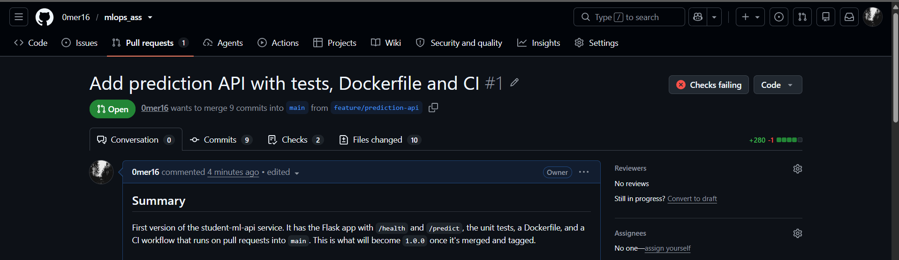
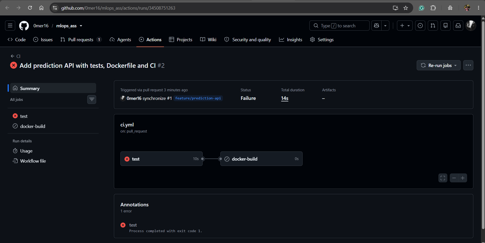
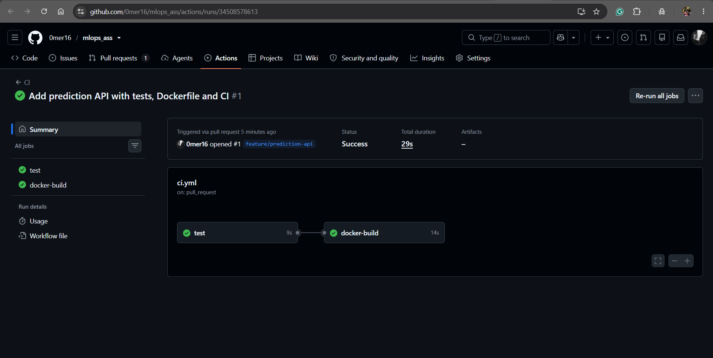
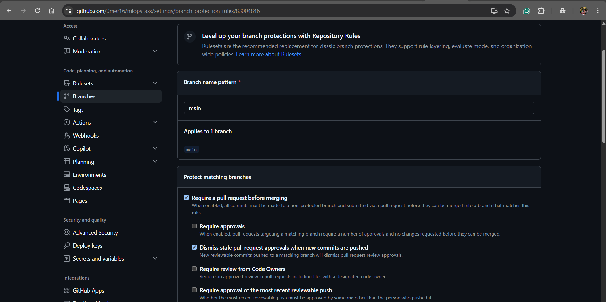

# Git workflow, CI and branch protection

This covers how changes got into `main`, the CI failure I caused on purpose, the branch protection settings, and the merge strategy.

## How everything got into main

The only commit made directly on `main` is `chore: initial commit` (`b52c94d`), which is just a README stub and a `.gitignore`. I needed something on `main` before I could open a PR against it. Everything after that went through a feature branch and a PR:

| PR | Branch | What it did | Merge commit | Release |
|---|---|---|---|---|
| [#1](https://github.com/0mer16/mlops_ass/pull/1) | `feature/prediction-api` | Flask app, tests, Dockerfile, CI workflow, release workflow | `8c371d2` | `v1.0.0` |
| [#2](https://github.com/0mer16/mlops_ass/pull/2) | `feature/image-metadata` | OCI labels, commit sha image tag, digest in the release summary | `93e0465` | none, went out with `v1.1.0` |
| [#3](https://github.com/0mer16/mlops_ass/pull/3) | `feature/model-metadata` | `application_version` + `model_version` in `/health`, bump to 1.1.0 | `7bd02d1` | `v1.1.0` |
| #4 | `docs/release-evidence` | these docs | | none |

Not every merge is a release. PR #2 and this one got merged without a tag, since a release only happens when I decide to push a version tag.

You can see the branches in the history with:

```bash
git log --oneline --graph
```

Each PR shows up as a side branch with its own commits, joined back in by a "Merge pull request #N" commit.

## Making CI fail on purpose (Part 6)

Once PR #1 was open and green, I broke a test to check that CI really blocks a bad PR. In `tests/test_app.py` I changed

```python
assert data["status"] == "healthy"
```

to

```python
assert data["status"] == "wrong"
```

and pushed it as `85d158d test: break health assertion on purpose to check CI fails`.

What happened ([run 34508751263](https://github.com/0mer16/mlops_ass/actions/runs/34508751263)):

- the `test` job failed with `AssertionError: assert 'healthy' == 'wrong'`
- `docker-build` was skipped, because it has `needs: test`
- the PR showed "Checks failing", and `gh pr view 1` reported the merge state as `BLOCKED`





Then I put the assertion back in `a54302a fix: correct health endpoint test`, and CI went green again ([run 34509503119](https://github.com/0mer16/mlops_ass/actions/runs/34509503119)).

This is what a green run looks like. The screenshot is the first run on the PR, before I broke the test ([run 34508578613](https://github.com/0mer16/mlops_ass/actions/runs/34508578613)):



I kept both commits in the history on purpose. They show the check actually doing its job.

## Branch protection on main (Part 7)

I used a classic branch protection rule on `main`:

| Setting | Value | Why |
|---|---|---|
| Require a pull request before merging | on | nothing reaches `main` without a PR |
| Required approvals | 0 | I'm doing this alone, and GitHub doesn't let you approve your own PR. In a team this would be at least 1 |
| Dismiss stale approvals when new commits are pushed | on | an approval shouldn't count for code pushed after it |
| Require status checks to pass | `test` and `docker-build` | a PR with failing tests or a Dockerfile that doesn't build can't be merged |
| Require branches to be up to date | on | the checks have to pass against the current `main`, not an old copy of it |
| Require conversation resolution | on | open review comments block the merge |
| Do not allow bypassing (include administrators) | on | I own the repo, so without this I could still push straight to `main` |
| Allow force pushes | off | nobody can rewrite `main`'s history |
| Allow deletions | off | `main` can't be deleted |



Since I'm solo, the "review" step in each PR is me reading through the diff and leaving a review comment before merging. It isn't a real approval, but it does leave a record of what I checked.

## Merge strategy (Part 8)

I used **merge commits** for every PR.

- The individual commits stay in `main`'s history. With squash, PR #1's 12 commits would have been squashed into one, and the broken test and its fix would disappear from `main`.
- The merge commit message says which PR it came from ("Merge pull request #3 from 0mer16/feature/model-metadata"), so going from a commit back to its PR is easy. That merge commit is also what the version tag points at, which is what the traceability chain needs.
- The downside is a busier history with extra merge commits. For a project this size that's fine, and `git log --first-parent` gives the clean one-line-per-PR view if I want it.

## Why CI and the release are separate workflows (Part 22)

`ci.yml` runs on pull requests. It tests the code and checks the image builds, and it has `permissions: contents: read`, so it couldn't push an image even by mistake.

`release.yml` only runs when a `v*.*.*` tag is pushed. It's the only workflow with `packages: write`.

Why I don't publish an image from every PR:

- Code in a PR hasn't been reviewed or merged yet. If every PR published an image, the registry would be full of images built from code that might never get approved, and somebody could pull and deploy one.
- A PR gets pushed to several times (PR #1 had four CI runs). Each push would add another image, and it'd be hard to tell which one is the real release.
- Versions would stop meaning anything. `1.1.0` should be one specific reviewed build, not whatever the last PR happened to push.
- PRs can come from forks, and you don't want code from a fork running with a token that can write to your registry. That's why GitHub only gives PRs from forks a read-only token.
- A release should be something you decide to do. Pushing a tag is that decision. Opening a PR just means "please check this".
