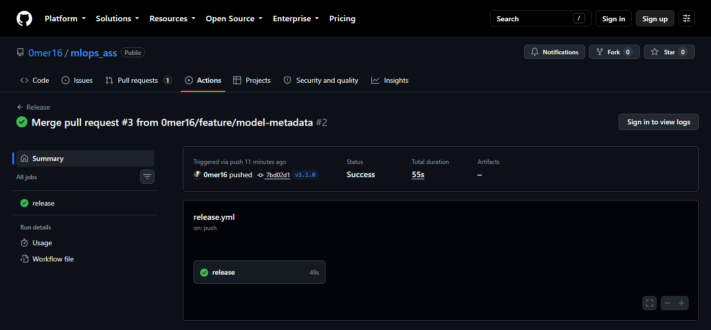
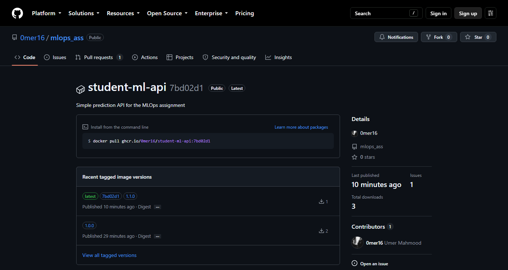

# Releases, the registry, rollback and traceability

## How a release happens (Parts 13-15)

After a PR is merged I tag the merge commit on `main` and push the tag:

```bash
git checkout main
git pull
git tag v1.1.0
git push origin v1.1.0
```

`.github/workflows/release.yml` only runs for tags matching `v*.*.*`. It runs the tests, gets the version from the tag with `${GITHUB_REF_NAME#v}` (so `v1.1.0` becomes `1.1.0`, and the version isn't typed anywhere in the YAML), checks it matches the `VERSION` file, logs in to GHCR with the `GITHUB_TOKEN` that GitHub creates for each run, builds the image, tags it and pushes it.

The two releases:

| Tag | Commit | Release run | Pushed tags |
|---|---|---|---|
| `v1.0.0` | `8c371d2` (merge of PR #1) | [34510352772](https://github.com/0mer16/mlops_ass/actions/runs/34510352772) | `1.0.0`, `latest` |
| `v1.1.0` | `7bd02d1` (merge of PR #3) | [34512270201](https://github.com/0mer16/mlops_ass/actions/runs/34512270201) | `1.1.0`, `latest`, `7bd02d1` |



(This was captured while signed out, so the summary table from the last step isn't shown. The same values are in the traceability section below.)

`v1.0.0` didn't get a sha tag or OCI labels because I only added those in PR #2, after 1.0.0 was already out. I didn't re-release 1.0.0 to add them, because then `1.0.0` would point at a different image than before, and the whole point is that a version always means the same image.

## What's in the registry (Parts 16 and 19)

Package: `ghcr.io/0mer16/student-ml-api` (public). The digest of each tag, straight from the registry:

| Tag | Digest |
|---|---|
| `1.0.0` | `sha256:1af8ad154334c03ec96843979bdb636792434d9a3572c61a48f800f5e8b0f357` |
| `1.1.0` | `sha256:68434cb0cb94f46b69f3d6fff059270e5806fe8df31373c60c3a47afddd537e3` |
| `latest` | `sha256:68434cb0cb94f46b69f3d6fff059270e5806fe8df31373c60c3a47afddd537e3` |
| `7bd02d1` | `sha256:68434cb0cb94f46b69f3d6fff059270e5806fe8df31373c60c3a47afddd537e3` |

I got these by asking the registry directly (`GET /v2/0mer16/student-ml-api/tags/list`, then the `Docker-Content-Digest` header for each tag). They match the `digest:` lines that `docker push` printed in the release logs.

The package page shows the same thing. `latest`, `7bd02d1` and `1.1.0` are grouped as one image version, and `1.0.0` is separate:



So `latest` → `1.1.0` (same digest), and `1.0.0` is still there with the same digest it had when it was first pushed. Before `v1.1.0`, `latest` had the `1.0.0` digest. It moved when 1.1.0 was released.

A tag is just a name that can be moved (`latest` moved). A digest is a hash of the image contents, so it can't. If two tags have the same digest, they're the same image, byte for byte.

## Pulling instead of rebuilding (Part 17)

To prove the registry image works on its own, I deleted my local image and pulled it back:

```
$ docker image remove student-ml-api:1.0.0
Untagged: student-ml-api:1.0.0
Deleted: sha256:5d91eccaa3090e0b493c12cf0a4cf07b0c66f7de46a520da50f41597b72a8925

$ docker pull ghcr.io/0mer16/student-ml-api:1.0.0
Digest: sha256:1af8ad154334c03ec96843979bdb636792434d9a3572c61a48f800f5e8b0f357
Status: Downloaded newer image for ghcr.io/0mer16/student-ml-api:1.0.0

$ docker run -d --name student-ml-api -p 5000:5000 ghcr.io/0mer16/student-ml-api:1.0.0
$ curl http://localhost:5000/health
{"application":"student-ml-api","status":"healthy","version":"1.0.0"}
```

The pulled digest is exactly the digest the release workflow pushed. The image was built once, on GitHub's runner, and my laptop just downloaded and ran it without building anything.

Something I noticed along the way: the image I built locally (`5d91ecc…`) and the one the release built (`1af8ad15…`) come from the same commit but have different IDs. Build time, the machine and so on end up in the image. That's why you promote the one image that was tested and released, instead of rebuilding it for each environment. A rebuild gives you a new image that happens to come from the same code.

## Rollback (Part 20)

The scenario: 1.1.0 is running and turns out to have a problem, so I need 1.0.0 back without touching the code and without building anything.

Running 1.1.0 first:

```
$ docker run -d --name student-ml-api -p 5000:5000 ghcr.io/0mer16/student-ml-api:1.1.0
$ curl http://localhost:5000/health
{"application":"student-ml-api","application_version":"1.1.0","model_version":"model-1","status":"healthy"}
```

Rolling back:

```
$ docker stop student-ml-api && docker container remove student-ml-api
$ docker run -d --name student-ml-api -p 5000:5000 ghcr.io/0mer16/student-ml-api:1.0.0
$ curl http://localhost:5000/health
{"application":"student-ml-api","status":"healthy","version":"1.0.0"}
```

That's it, two commands. The running image is `ghcr.io/0mer16/student-ml-api@sha256:1af8ad15…`, the same one that was released as 1.0.0.

Why this is easier than deploying with `git clone`, `pip install`, `python app.py`:

- Rolling back that way means checking out the old code and running `pip install` again. pip resolves dependencies at install time, so a package could have a new release, get yanked, or PyPI could just be down. You don't get back what was actually running before, only something built from the same source.
- It depends on the server having the right Python version and system libraries. The image already has Python 3.13.14 and the exact package versions inside it.
- It's slower. A pull is a download, and if the old image is still cached on the machine, rolling back is basically instant.
- The known good version is a single thing you can point at (`1.0.0`, or its digest). With a git-based deploy, "the version that worked" is a commit plus whatever pip happened to install that day.
- It's the same command for every version, so whoever does the rollback just needs the tag, not the whole setup process.

## Traceability for 1.1.0 (Part 21)

| | |
|---|---|
| Pull request | [#3](https://github.com/0mer16/mlops_ass/pull/3), "Release 1.1.0: report application and model version in /health" |
| Merge commit | `7bd02d1e89189977b5a8c4488455451f8200308c` |
| Git tag | `v1.1.0` → `7bd02d1e89189977b5a8c4488455451f8200308c` |
| Release run | [34512270201](https://github.com/0mer16/mlops_ass/actions/runs/34512270201) |
| Docker image tags | `ghcr.io/0mer16/student-ml-api:1.1.0`, `:latest`, `:7bd02d1` |
| Image digest | `sha256:68434cb0cb94f46b69f3d6fff059270e5806fe8df31373c60c3a47afddd537e3` |

It works in both directions:

- **From the PR:** PR #3 shows its merge commit, `git tag --points-at 7bd02d1` gives `v1.1.0`, and the release run for that tag lists the image tags and digest in its summary.
- **From the image:** the labels inside the image give the commit.

```
$ docker image inspect --format "{{json .Config.Labels}}" ghcr.io/0mer16/student-ml-api:1.1.0
{
  "org.opencontainers.image.created": "2026-09-10T18:06:42Z",
  "org.opencontainers.image.description": "Simple prediction API for the MLOps assignment",
  "org.opencontainers.image.revision": "7bd02d1e89189977b5a8c4488455451f8200308c",
  "org.opencontainers.image.source": "https://github.com/0mer16/mlops_ass",
  "org.opencontainers.image.title": "student-ml-api",
  "org.opencontainers.image.version": "1.1.0"
}
```

(I spread the JSON over several lines to make it readable.)

`revision` is the full commit sha and `source` is the repo, so `git show 7bd02d1` shows the "Merge pull request #3" commit, which leads back to the PR.

For 1.0.0 the chain is PR #1 → `8c371d2` → `v1.0.0` → `1.0.0` → `sha256:1af8ad15…`. That image has no labels (see above), so the only way back from the image is its digest, which I've recorded here.

## Why the commit sha tag is useful (Part 24)

Every release now also pushes a tag named after the short commit sha, like `student-ml-api:7bd02d1`.

- `latest` moves on every release, so it can't tell you what was running last week. The sha tag always points at the image built from that one commit.
- If I'm looking at a commit in the git history (in a bug report, `git blame`, etc.), I can pull the exact image for it without first working out which version it was released in.
- Version tags can technically be pushed over, whether by mistake or by re-running a release. A sha tag only makes sense for one commit, so it's much harder to mix up.
- If I ever build images for commits that aren't releases (a staging build, say), they'd still have a unique tag that doesn't use up a version number.
